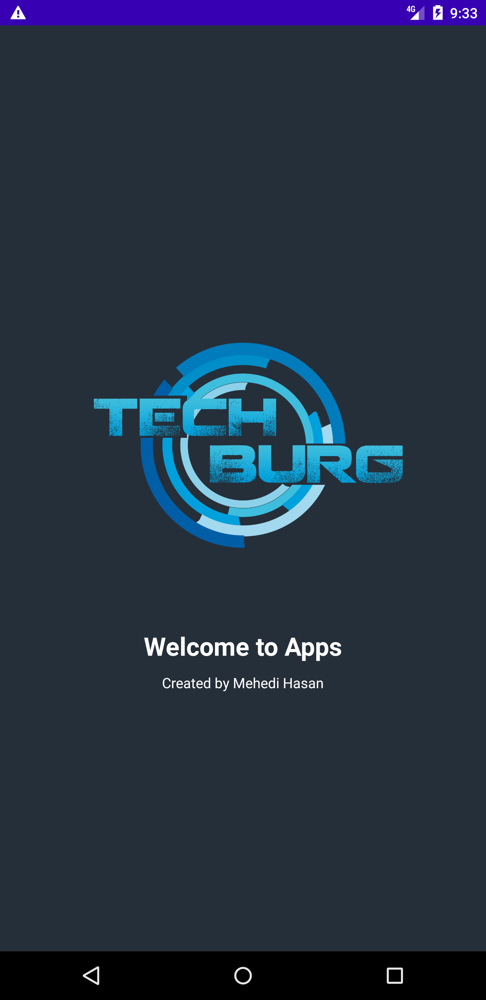

# Simple-Android-Splash-Screen-Demo
Simple Splash Screen Demo using visibililty
This a simple demo of Splash Screen. Splash Screen. Splash Screen one of the exciting feature in android, is referred to a welcome screen or user's first experience of an application. It is very useful for decorating an Android Apps. There are different ways to show a splash screen or welcome screen in android. Now I created very very simple logic in splash screen. Here I just use item visibility trick to show splash screen. This code does not follow creating new layout for showing splash screen. Here I have combined several views using visibility tricks. You can see the demo:

